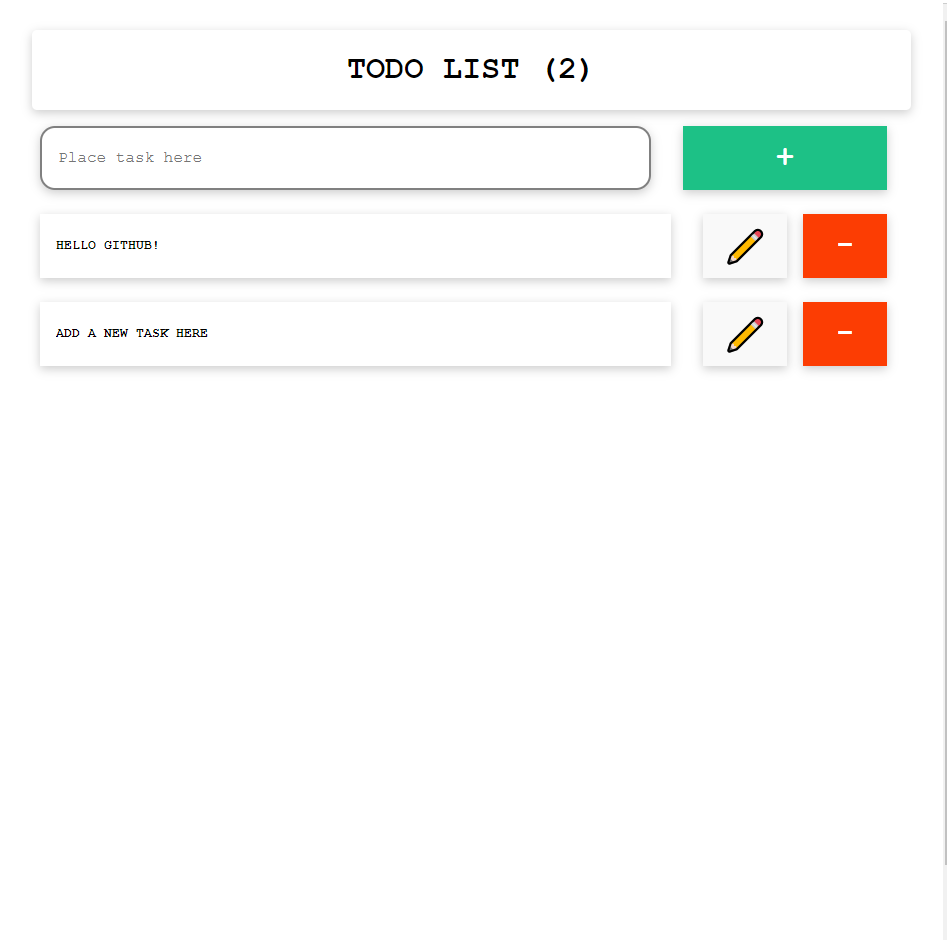
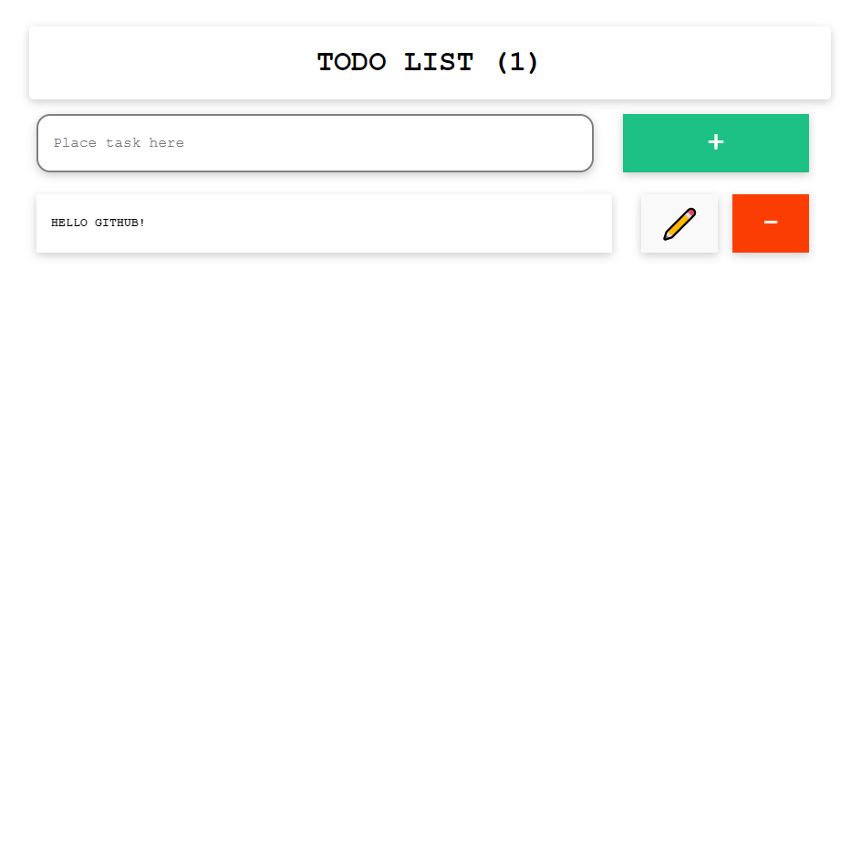
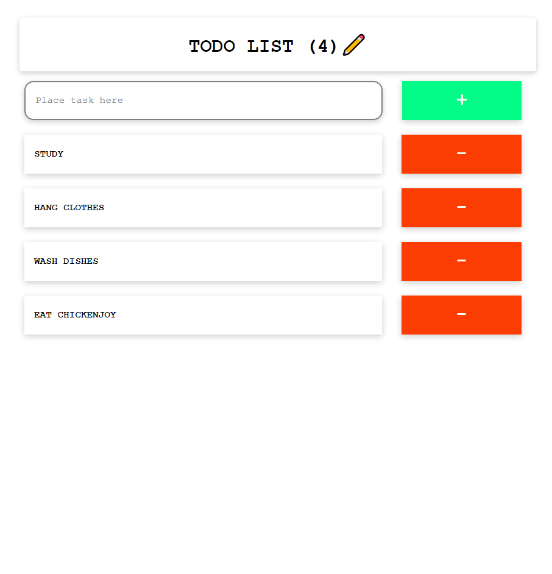
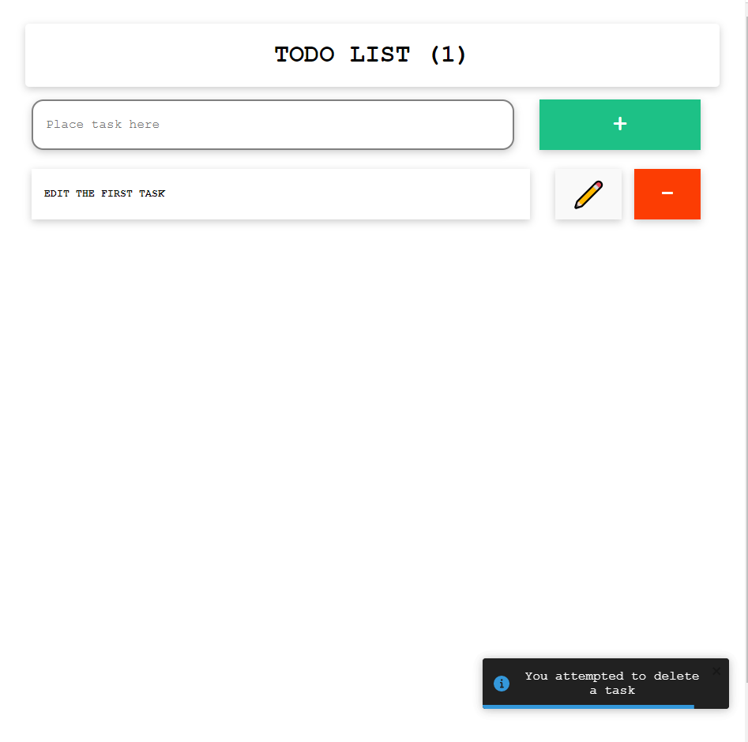

# simpleTODO description
  An application created to familiarize the use of firebase, specifically firestore with a react application. The application has no authentication and can only be used for adding and deleting "tasks" on the database created on firebase.
  
## Application Screenshots

